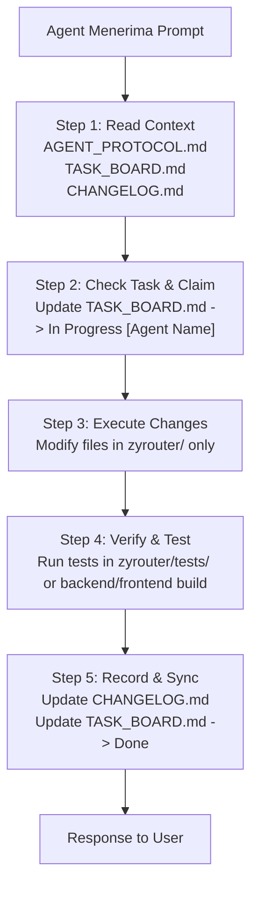

# Multi-Agent Synchronization Protocol (Antigravity • ZCode • Codex)

> **Protokol Standar Operasional untuk Pengembangan Kolaboratif Zyrouter**  
> File ini adalah **Single Source of Truth (SSOT)** panduan kerja untuk 3 AI Agent: **Antigravity**, **ZCode**, dan **Codex**.

---

## 1. Prinsip Utama & Peraturan Workspace

1. **Isolasi Workspace & Anti-Polusi:**
   - Folder `9router-custom/` dan `9router-go-patched/` berstatus **STRICTLY READ-ONLY REFERENCE**. Dilarang mengubah, menambah, menghapus, atau memindahkan file di kedua folder tersebut.
   - Seluruh kode baru, konfigurasi, dan dokumentasi **HANYA** boleh ditulis di dalam folder `zyrouter/`.
   - Dilarang membuat file sementara, file dump, file log percobaan di root workspace (`c:\Users\Administrator\Documents\bot\zyvenoxrouter\`).
   - Semua script pengujian, benchmark, dummy request, dan testing tool **WAJIB** ditaruh di dalam folder `zyrouter/tests/`.

2. **Zero Mockup / Zero Fake Data:**
   - Dilarang keras menggunakan data mockup, data statis hardcoded, atau dummy placeholder pada UI/Backend.
   - Semua visualisasi metrics, health status, daftar provider, log console, dan model resolver harus terhubung ke backend Go engine dan database SQLite riil (`zyrouter.db`).

3. **100% Feature Parity & No Unapproved Features:**
   - Semua fitur yang ada pada `9router-custom` dan `9router-go-patched` **harus dipertahankan 100%**.
   - Dilarang menghapus fitur bawaan tanpa instruksi user.
   - Dilarang menambah fitur liar di luar PRD / kesepakatan bersama.

4. **100% Redesigned Dashboard:**
   - Tampilan antarmuka (UI/UX) pada `zyrouter/frontend` harus **100% baru dan modern** (Sleek Dark Cyber/Minimalist Glassmorphism, high aesthetic density), tidak boleh menjiplak tata letak/komponen visual bawaan 9router.

---

## 2. Alur Kerja Wajib Sebelum & Sesudah Melakukan Perubahan

Setiap kali agent (Antigravity / ZCode / Codex) menerima prompt atau perintah dari user, agent **WAJIB** menjalankan langkah berikut secara berurutan:



### Step-by-Step Checklist:

1. **Step 1: Baca File Status & Riwayat**
   - Baca [AGENT_PROTOCOL.md](file:///c:/Users/Administrator/Documents/bot/zyvenoxrouter/zyrouter/AGENT_PROTOCOL.md) (aturan ini).
   - Baca [TASK_BOARD.md](file:///c:/Users/Administrator/Documents/bot/zyvenoxrouter/zyrouter/TASK_BOARD.md) untuk melihat task mana yang sedang dikerjakan agent lain atau yang sudah selesai.
   - Baca entri terbaru di [CHANGELOG.md](file:///c:/Users/Administrator/Documents/bot/zyvenoxrouter/zyrouter/CHANGELOG.md) untuk memahami perubahan terakhir yang dilakukan agent lain.

2. **Step 2: Klaim Task di Task Board**
   - Sebelum mulai mengedit kode, buka `TASK_BOARD.md` dan ubah status task yang akan dikerjakan menjadi:
     `- [ ] [IN PROGRESS - <NamaAgent>] Task Name`

3. **Step 3: Eksekusi Kode**
   - Lakukan perubahan hanya di dalam sub-folder `zyrouter/`.
   - Gunakan referensi kode dari `9router-go-patched/` untuk backend Go dan `9router-custom/` untuk logika fitur/rute.
   - Pastikan kode modular, clean, memiliki error handling yang robust, dan tipe data yang konsisten.

4. **Step 4: Validasi & Testing**
   - Jalankan verifikasi (misal: compile test `go build`, typecheck `npm run build` / linting, atau test script di `zyrouter/tests/`).

5. **Step 5: Catat Log & Tandai Selesai**
   - Tambahkan entri baru di [CHANGELOG.md](file:///c:/Users/Administrator/Documents/bot/zyvenoxrouter/zyrouter/CHANGELOG.md) dengan format standar (lihat Format Changelog di bawah).
   - Update status task di `TASK_BOARD.md` menjadi `[DONE - <NamaAgent>]`.

---

## 3. Format Penulisan Changelog

Setiap perubahan **WAJIB** dicatat di `zyrouter/CHANGELOG.md` dengan struktur berikut:

```markdown
### [YYYY-MM-DD HH:mm WIB] - [AGENT_NAME] - <Judul Singkat Perubahan>
- **Modul**: `Backend / Frontend / Docs / DB / Tests`
- **File Diubah / Dibuat**:
  - `[NEW] zyrouter/backend/internal/auth/restrictions.go`
  - `[MOD] zyrouter/backend/internal/handlers/chat/completions.go`
- **Deskripsi Perubahan**:
  - Implementasi validasi pembatasan model dan prefix provider pada middleware auth.
- **Status Task**: Selesai / Terhubung ke TASK-004
- **Catatan untuk Agent Lain**:
  - Struct `APIKey` di `models/types.go` sekarang memiliki field `Restrictions models.KeyRestrictions`.
```

---

## 4. Pembagian Wilayah Kerja (Role Guidelines)

Untuk meminimalkan potensi konflik merge dan redundansi:

| Modul | Deskripsi Utama | File / Folder Relevan |
| :--- | :--- | :--- |
| **Go Engine & Proxy** | Core routing, OpenAI/Claude/Gemini translator, streaming SSE, combo strategies, token saver | `zyrouter/backend/internal/proxy/`, `handlers/`, `tokensaver/` |
| **Auth & Restrictions** | Validasi key, model whitelist, prefix matching, provider locks, rate limit | `zyrouter/backend/internal/auth/`, `models/`, `db/` |
| **Management REST API**| Endpoint CRUD untuk dashboard (Providers, Combos, Keys, Settings, Pools, MITM) | `zyrouter/backend/internal/handlers/admin/` |
| **Redesigned Dashboard**| Modern Dark UI, Topology real-time visualizer, Metrics, Settings, Interceptors | `zyrouter/frontend/` |
| **Database & Schema** | SQLite repo, migrations, indexing, table maintenance | `zyrouter/backend/internal/db/`, `zyrouter/docs/DATABASE.md` |
| **Testing Sandbox** | E2E integration test, mock provider benchmarks, load tests | `zyrouter/tests/` |

---

## 5. Pertanyaan & Eskalasi

Jika ada konflik desain, ambiguitas spesifikasi, atau kebutuhan fitur baru di luar PRD, **JANGAN MENYIMPULKAN SENDIRI**. Tanyakan langsung kepada USER dalam prompt balasan.
