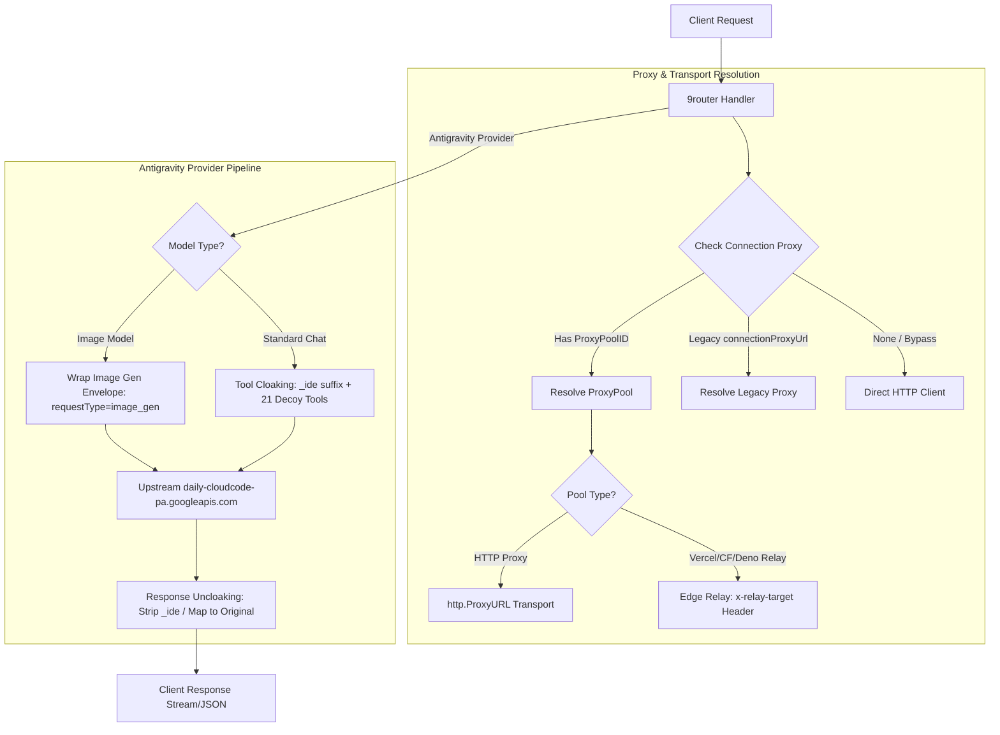

# Design Document: Proxy Pool Fixes & Antigravity Parity (Cloaking & Image Gen)

**Date:** 2026-08-14  
**Author:** Antigravity AI  
**Status:** Approved  

---

## 1. Background & Context

The Next.js implementation of 9router (`v0.5.35`) includes several advanced capabilities for **Proxy Pools** and **Google Antigravity** that were either missing or had discrepancies in `9router-go`:

1. **Proxy Pool Bug & Edge Relay Support**:
   - `GetProxyPool` in Go only parsed `raw["urls"]` (array), while the database stored single `raw["proxyUrl"]` (string) as created by the Next.js UI / `InsertProxyPool`. This caused proxy pools to be silently ignored (`NextURL()` returned `""`) and requests fell back to direct connections.
   - Edge relay deployments (Vercel, Cloudflare, Deno) require custom header manipulation (`x-relay-target` and `x-relay-path`) rather than standard HTTP forward proxies (`http.ProxyURL`).
   - Legacy connection-level proxies (`connectionProxyUrl`), `noProxy` filtering, and `strictProxy` enforcement were unhandled.
2. **Antigravity Tool Cloaking**:
   - Next.js cloaked client tools with `_ide` suffix and injected 21 official Antigravity IDE decoy tools so third-party agent requests (Claude Code, Cursor, Cline, OpenClaw) match official IDE traffic fingerprints.
3. **Antigravity Native Image Generation**:
   - Next.js supported Gemini image generation models via Antigravity envelope (`requestType: "image_gen"` with aspect ratio parsing and base64 response formatting).

---

## 2. Goals & Non-Goals

### Goals
- Fix `GetProxyPool` in `internal/db/proxyPools.go` to correctly read `proxyUrl` strings and load pool metadata (`type`, `noProxy`, `strictProxy`).
- Implement transport support for Edge Relays (`vercel`, `cloudflare`, `deno`), `noProxy` wildcard matching, `strictProxy` error propagation, and legacy per-connection proxy fallback.
- Implement Antigravity tool cloaking with `_ide` suffixing, 21 decoy tools injection, and seamless uncloaking in stream & non-stream response translation.
- Implement Antigravity native image generation with aspect ratio resolution, `requestType: "image_gen"` envelope wrapping, and base64 OpenAI-compatible response formatting.
- Maintain full backward compatibility and zero regressions across existing OpenAI/Claude/Gemini proxy pipelines.

### Non-Goals
- Modifying SQLite database table schemas (database schema remains 100% byte-compatible with Next.js).
- Changing Google OAuth handshake or daily endpoint URL migration (already in place).

---

## 3. Architecture & Detailed Design



---

### Section 1: Proxy Pool Full Fix & Edge Relay Engine

#### 1.1 `internal/db/proxyPools.go`
- Update `ProxyPool` struct:
  ```go
  type ProxyPool struct {
      ID          string   `json:"id"`
      Name        string   `json:"name"`
      IsActive    bool     `json:"isActive"`
      URLs        []string `json:"urls"`
      Strategy    string   `json:"strategy"` // "round-robin" or "random"
      Type        string   `json:"type"`     // "http", "vercel", "cloudflare", "deno"
      NoProxy     string   `json:"noProxy"`
      StrictProxy bool     `json:"strictProxy"`
      index       uint64
  }
  ```
- In `GetProxyPool`:
  ```go
  if urls, ok := raw["urls"].([]any); ok {
      for _, u := range urls {
          if s, ok := u.(string); ok && s != "" {
              pool.URLs = append(pool.URLs, s)
          }
      }
  }
  // Fallback to single proxyUrl field if urls array is empty
  if len(pool.URLs) == 0 {
      if singleURL := handlerutil.GetString(raw, "proxyUrl"); singleURL != "" {
          pool.URLs = append(pool.URLs, singleURL)
      }
  }
  pool.Type = handlerutil.GetString(raw, "type")
  if pool.Type == "" {
      pool.Type = "http"
  }
  pool.NoProxy = handlerutil.GetString(raw, "noProxy")
  if sp, ok := raw["strictProxy"].(bool); ok {
      pool.StrictProxy = sp
  }
  ```

#### 1.2 `internal/proxy/transport.go` & `internal/handlers/chat/connections.go`
- Expand `ConnectionData`:
  ```go
  type ConnectionData struct {
      ...
      ProxyPoolID            string `json:"proxyPoolId"`
      ConnectionProxyEnabled bool   `json:"connectionProxyEnabled"`
      ConnectionProxyURL     string `json:"connectionProxyUrl"`
      ConnectionNoProxy      string `json:"connectionNoProxy"`
  }
  ```
- Add `ProxyConfig` resolver:
  ```go
  type ResolvedProxy struct {
      Type        string // "http", "vercel", "cloudflare", "deno", "legacy", "none"
      ProxyURL    string
      NoProxy     string
      StrictProxy bool
  }
  ```
- **NoProxy Wildcard Matching**:
  Helper `ShouldBypassNoProxy(targetURL string, noProxy string) bool`:
  - Splits comma-separated patterns.
  - Matches `*`, `.domain.com`, `domain.com`, `IP`, `CIDR`.
- **Edge Relay Routing**:
  If `ResolvedProxy.Type` is `vercel`, `cloudflare`, or `deno`:
  - Request target becomes `ResolvedProxy.ProxyURL`.
  - Injects headers:
    - `x-relay-target`: `<upstream_scheme>://<upstream_host>`
    - `x-relay-path`: `<upstream_path_and_query>`

---

### Section 2: Antigravity Tool Cloaking & Anti-Ban Decoy System

#### 2.1 Decoy Tool Registry & Cloaking ([antigravity.go](file:///Users/luqmannul.hakim/gomod/project/9router-go/internal/translator/antigravity.go))
- Add native Antigravity default tool names set:
  ```go
  var AntigravityNativeToolNames = map[string]bool{
      "browser_subagent": true, "command_status": true, "find_by_name": true,
      "generate_image": true, "grep_search": true, "list_dir": true,
      "list_resources": true, "mcp_sequential-thinking_sequentialthinking": true,
      "multi_replace_file_content": true, "notify_user": true, "read_resource": true,
      "read_terminal": true, "read_url_content": true, "replace_file_content": true,
      "run_command": true, "search_web": true, "send_command_input": true,
      "task_boundary": true, "view_content_chunk": true, "view_file": true,
      "write_to_file": true,
  }
  ```
- Define `AntigravityDecoyTools`: 21 decoy tool declarations matching Google Antigravity official schema with `description: "This tool is currently unavailable."`.
- **Cloak Function**:
  `CloakAntigravityRequest(req *GeminiRequest, clientTool string) (*GeminiRequest, map[string]string)`
  - Renames client tools not in `AntigravityNativeToolNames` to `<name>_ide`.
  - Appends `AntigravityDecoyTools` after client tools.
  - Updates `contents` message history (`functionCall.name` and `functionResponse.name`) with `_ide` suffix.
  - Returns updated request and `toolNameMap` (mapping `suffixed_name -> original_name`).

#### 2.2 Response Uncloaking ([gemini.go](file:///Users/luqmannul.hakim/gomod/project/9router-go/internal/translator/gemini.go))
- In non-stream translation (`TranslateGeminiResponseToOpenAI`) and SSE stream translation (`TranslateGeminiChunkToOpenAI`):
  - If a tool call name ends with `_ide`, strip `_ide` or look up in `toolNameMap`.
  - The client receives the clean original tool name (e.g. `Bash`, `ReadFile`).

---

### Section 3: Antigravity Native Image Generation

#### 3.1 Model Detection & Configuration
- `IsAntigravityImageModel(model string) bool`:
  Checks for patterns `image`, `imagen`, `image-generation`.
- `ParseImageConfig(model string) (cleanModel string, aspectRatio string)`:
  - Parses `-16x9`, `-4x3`, `-1x1`, `-1024x768` (reduces gcd to ratio).
  - Defaults to `1:1`.

#### 3.2 Request Envelope
- Wraps request in Antigravity envelope:
  ```json
  {
    "project": "<project_id>",
    "model": "<clean_model>",
    "userAgent": "antigravity",
    "requestType": "image_gen",
    "requestId": "agent/<conversationId>/<timestamp>/<trajectoryId>/<step>",
    "request": {
      "contents": [{ "role": "user", "parts": [{ "text": "<prompt>" }] }],
      "generationConfig": {
        "temperature": 1.0,
        "topP": 0.95,
        "topK": 40,
        "maxOutputTokens": 8192,
        "imageConfig": { "aspectRatio": "16:9" }
      },
      "sessionId": "<session_id>"
    }
  }
  ```
- Upstream action: Forced non-streaming `POST /v1internal:generateContent`.

#### 3.3 Response Normalization
- Extracts `candidates[0].content.parts[].inlineData.data`.
- Formats OpenAI Image response:
  ```json
  {
    "created": 1755172000,
    "data": [
      {
        "b64_json": "<base64_image>"
      }
    ]
  }
  ```

---

## 4. Error Handling & Edge Cases

1. **Proxy Failures**:
   - If `strictProxy` is enabled and the proxy cannot connect, abort immediately with 502 Bad Gateway.
   - If `strictProxy` is false, log warning and fallback to direct client.
2. **Malformed Tool Names**:
   - `sanitizeFunctionName`: Ensure tool names conform to Gemini's regex `^[a-zA-Z_][a-zA-Z0-9_.:\-]{0,63}$`.
3. **Decoy Collisions**:
   - If client already defined a tool matching an Antigravity decoy name, the client tool takes precedence and duplicate decoys are deduplicated.
4. **Missing Images in Output**:
   - If Google returns no `inlineData` for image generation, return clean error message rather than panic or nil pointer.

---

## 5. Verification Plan

1. **Unit Tests**:
   - `internal/db/proxyPools_test.go`: Test `GetProxyPool` with single `proxyUrl`, `urls` array, edge relay types, and `noProxy`.
   - `internal/handlers/chat/connections_test.go`: Test proxy resolution priority (Pool > Legacy > Direct) and `noProxy` bypass.
   - `internal/translator/antigravity_test.go`:
     - Test `CloakAntigravityRequest` tool renaming and decoy tool injection.
     - Test `UncloakToolName` on stream and non-stream outputs.
     - Test image model detection, aspect ratio parsing, and envelope generation.
2. **End-to-End Functional Tests**:
   - Benchmark & proxy test suites (`go test ./...`).
   - MITM proxy integration verification.
