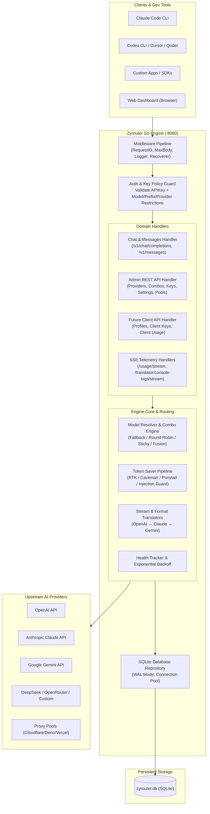
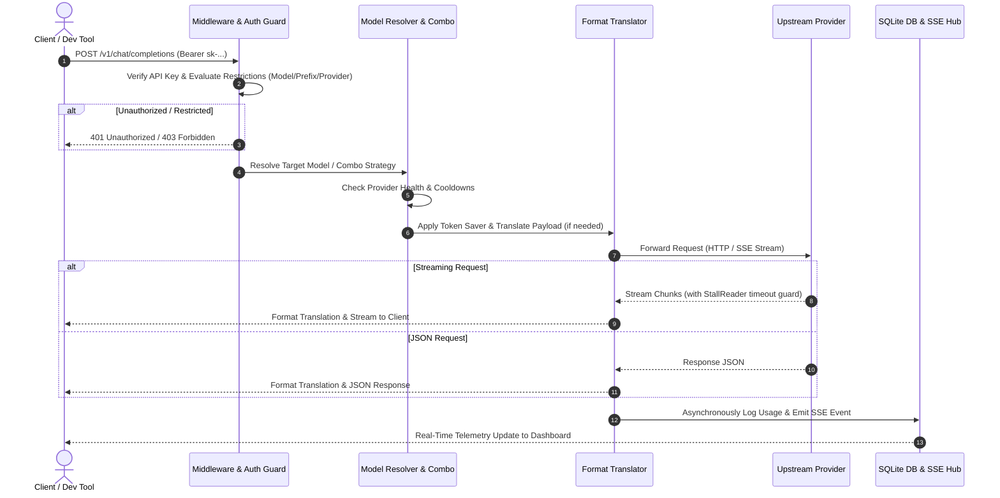

# Zyrouter — System Architecture Specification

> **Active scope update (2026-09-02):** The runtime is proxy-first. Media, MITM, Headroom, and CLI-tool components shown in historical diagrams are retired; edge deployment remains active in `internal/handlers/deployment`.

## Active Runtime Boundary

```text
Client -> Go Proxy -> Auth/Prefix Policy -> Resolver -> Router -> Provider Adapter -> Upstream

Admin Dashboard  -> Admin REST API
Future Client UI -> Client REST API (server-side policy enforced)
Proxy Pool Deployments -> Cloudflare / Deno / Vercel
```

Dokumentasi arsitektur teknis menyeluruh untuk **Zyrouter** (Zyvenox AI Router & Proxy Gateway).

---

## 1. High-Level System Architecture



---

## 2. Request Lifecycle & Pipeline



---

## 3. Komponen Arsitektur Backend (Golang)

### 3.1. `internal/auth`
- **Key Validation:** Verifikasi hash/string API Key terhadap database.
- **Restriction Engine:**
  - `CheckModelAllowed(key, requestedModel)`: Cek apakah model ada di whitelist.
  - `CheckPrefixAllowed(key, requestedModel)`: Cek apakah prefix model sesuai pola (misal: `claude-*`).
  - `CheckProviderAllowed(key, resolvedProvider)`: Cek apakah provider connection diizinkan untuk key ini.

### 3.2. `internal/proxy` & `internal/translator`
- **Zero-Allocation Stream Translators:** Menerjemahkan event SSE antara OpenAI format dan Claude format secara streaming tanpa buffering penuh memori.
- **StallReader Wrapper:** Memonitor setiap chunk upstream dengan timeout 6 menit. Jika koneksi macet, StallReader menutup koneksi dengan aman dan memicu fallback.
- **Multi-Panel Fusion Engine:** Mengirim request paralel ke $N$ model panel, mengumpulkan respons berdasarkan batas toleransi waktu (*straggler grace*), dan mengirim hasil ke model *Judge* untuk sintesis.

### 3.3. `internal/tokensaver`
- **RTK:** Input prompt compression.
- **Caveman & Ponytail:** System prompt injection untuk kontrol gaya respon ringkas/kode efisien.
- **Prompt Injection Guard:** Heuristik deteksi pola jailbreak/injeksi berbahaya.

### 3.4. `internal/db`
- Berbasis `database/sql` + SQLite driver (`modernc.org/sqlite` atau `mattn/go-sqlite3`).
- Mode `WAL` (Write-Ahead Logging) diaktifkan untuk konkurensi baca/tulis tinggi.
- Pragma: `PRAGMA busy_timeout = 5000;`, `PRAGMA journal_mode = WAL;`, `PRAGMA synchronous = NORMAL;`.

---

## 4. Komponen Arsitektur Frontend (100% Redesigned)

### 4.1. Arsitektur State & Data Flow
- **Data Hydration:** Dashboard mengambil konfigurasi awal via REST API Go (`/api/providers`, `/api/combos`, `/api/keys`, `/api/settings`).
- **Live Stream Engine:** Membuka koneksi EventSource ke `/usage/stream` dan `/translator/console-logs/stream` untuk memperbarui topologi lalu lintas dan grafik real-time.
- **Zero Mock Policy:** Komponen UI dirancang dengan empty-state yang elegan saat belum ada provider/kunci yang dikonfigurasi.

### 4.2. Struktur Modul Frontend
```
zyrouter/frontend/
├── src/
│   ├── components/
│   │   ├── ui/             # Button, Modal, Input, Badge, Slider, Switch (Glassmorphism)
│   │   ├── topology/       # Real-time traffic visualizer (SVG/Canvas nodes & edges)
│   │   ├── charts/         # Token usage & cost charts
│   │   ├── forms/          # Provider modal, Combo builder, API Key restriction builder
│   │   └── layout/         # Sidebar, Header, Live status pill, Quick search
│   ├── pages/              # Overview, Providers, Combos, Keys, Usage, Logs, Settings
│   ├── lib/                # API client, SSE managers, formatters, storage helpers
│   └── styles/             # Design tokens, cyber gradients, glow utilities
```
