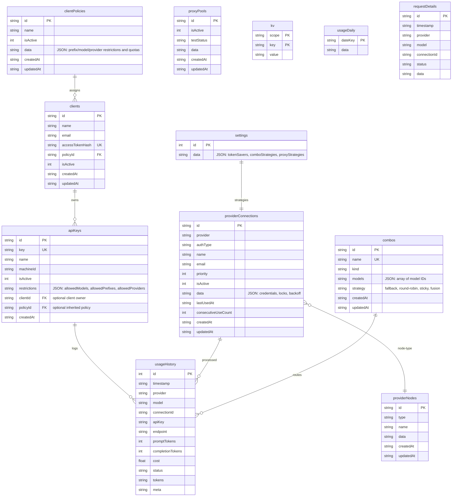

# Zyrouter SQLite Database Schema

Dokumentasi skema database SQLite untuk **Zyrouter** (`zyrouter.db`).

---

## 1. Konfigurasi Database Engine

- **Database File:** `zyrouter.db`
- **Engine Pragmas:**
  ```sql
  PRAGMA journal_mode = WAL;
  PRAGMA busy_timeout = 5000;
  PRAGMA synchronous = NORMAL;
  PRAGMA foreign_keys = ON;
  ```

---

## 2. Entity-Relationship Diagram



---

## 3. Detail Definisi Tabel

### 3.1. `apiKeys` (Dengan Ekstensi Restriksi)
```sql
CREATE TABLE IF NOT EXISTS apiKeys (
    id           TEXT PRIMARY KEY,
    key          TEXT UNIQUE NOT NULL,
    name         TEXT,
    machineId    TEXT,
    isActive     INTEGER DEFAULT 1,
    restrictions TEXT,                     -- JSON blob restriksi akses (Fitur Baru)
    createdAt    TEXT NOT NULL,
    clientId     TEXT,
    policyId     TEXT
);

CREATE INDEX IF NOT EXISTS idx_ak_key ON apiKeys(key);
CREATE INDEX IF NOT EXISTS idx_ak_active ON apiKeys(isActive);
CREATE INDEX IF NOT EXISTS idx_ak_client ON apiKeys(clientId);

CREATE TABLE IF NOT EXISTS clientPolicies (
    id        TEXT PRIMARY KEY,
    name      TEXT NOT NULL,
    isActive  INTEGER DEFAULT 1,
    data      TEXT NOT NULL,
    createdAt TEXT NOT NULL,
    updatedAt TEXT NOT NULL
);

CREATE TABLE IF NOT EXISTS clients (
    id              TEXT PRIMARY KEY,
    name            TEXT NOT NULL,
    email           TEXT,
    accessTokenHash TEXT UNIQUE NOT NULL,
    policyId        TEXT,
    isActive        INTEGER DEFAULT 1,
    createdAt       TEXT NOT NULL,
    updatedAt       TEXT NOT NULL
);

CREATE INDEX IF NOT EXISTS idx_clients_token ON clients(accessTokenHash);
CREATE INDEX IF NOT EXISTS idx_clients_policy ON clients(policyId);
```

#### Struktur `restrictions` JSON:
```json
{
  "allowedModels": ["gpt-4o", "claude-3-5-sonnet-20241022"],
  "allowedPrefixes": ["claude-*", "deepseek-*"],
  "allowedProviders": ["conn-openai-main"],
  "blockedModels": [],
  "rateLimit": {
    "requestsPerMinute": 60,
    "tokensPerDay": 10000000
  },
  "expiresAt": "2026-12-31T23:59:59Z"
}
```

---

### 3.2. `providerConnections`
```sql
CREATE TABLE IF NOT EXISTS providerConnections (
    id                  TEXT PRIMARY KEY,
    provider            TEXT NOT NULL,
    authType            TEXT NOT NULL,
    name                TEXT,
    email               TEXT,
    priority            INTEGER DEFAULT 10,
    isActive            INTEGER DEFAULT 1,
    data                TEXT NOT NULL,
    lastUsedAt          TEXT,
    consecutiveUseCount INTEGER DEFAULT 0,
    createdAt           TEXT NOT NULL,
    updatedAt           TEXT NOT NULL
);

CREATE INDEX IF NOT EXISTS idx_pc_provider ON providerConnections(provider);
CREATE INDEX IF NOT EXISTS idx_pc_provider_active ON providerConnections(provider, isActive);
CREATE INDEX IF NOT EXISTS idx_pc_priority ON providerConnections(provider, priority);
```

---

### 3.3. `combos`
```sql
CREATE TABLE IF NOT EXISTS combos (
    id        TEXT PRIMARY KEY,
    name      TEXT UNIQUE NOT NULL,
    kind      TEXT,
    models    TEXT NOT NULL,
    strategy  TEXT DEFAULT 'fallback',
    createdAt TEXT NOT NULL,
    updatedAt TEXT NOT NULL
);

CREATE INDEX IF NOT EXISTS idx_combo_name ON combos(name);
```

---

### 3.4. `providerNodes` & `proxyPools`
```sql
CREATE TABLE IF NOT EXISTS providerNodes (
    id        TEXT PRIMARY KEY,
    type      TEXT,
    name      TEXT,
    data      TEXT NOT NULL,
    createdAt TEXT NOT NULL,
    updatedAt TEXT NOT NULL
);

CREATE TABLE IF NOT EXISTS proxyPools (
    id         TEXT PRIMARY KEY,
    isActive   INTEGER DEFAULT 1,
    testStatus TEXT,
    data       TEXT NOT NULL,
    createdAt  TEXT NOT NULL,
    updatedAt  TEXT NOT NULL
);
```

---

### 3.5. `kv` (Key-Value Generic Store)
```sql
CREATE TABLE IF NOT EXISTS kv (
    scope TEXT NOT NULL,
    key   TEXT NOT NULL,
    value TEXT NOT NULL,
    PRIMARY KEY (scope, key)
);

CREATE INDEX IF NOT EXISTS idx_kv_scope ON kv(scope);
```

---

### 3.6. `settings`, `usageHistory`, `usageDaily`, `requestDetails`
```sql
CREATE TABLE IF NOT EXISTS settings (
    id   INTEGER PRIMARY KEY CHECK (id = 1),
    data TEXT NOT NULL
);

CREATE TABLE IF NOT EXISTS usageHistory (
    id               INTEGER PRIMARY KEY AUTOINCREMENT,
    timestamp        TEXT NOT NULL,
    provider         TEXT,
    model            TEXT,
    connectionId     TEXT,
    apiKey           TEXT,
    endpoint         TEXT,
    promptTokens     INTEGER DEFAULT 0,
    completionTokens INTEGER DEFAULT 0,
    cost             REAL DEFAULT 0,
    status           TEXT,
    tokens           TEXT,
    meta             TEXT
);

CREATE INDEX IF NOT EXISTS idx_uh_timestamp ON usageHistory(timestamp);
CREATE INDEX IF NOT EXISTS idx_uh_apikey ON usageHistory(apiKey);

CREATE TABLE IF NOT EXISTS usageDaily (
    dateKey TEXT PRIMARY KEY,
    data    TEXT NOT NULL
);

CREATE TABLE IF NOT EXISTS requestDetails (
    id           TEXT PRIMARY KEY,
    timestamp    TEXT NOT NULL,
    provider     TEXT,
    model        TEXT,
    connectionId TEXT,
    status       TEXT,
    data         TEXT NOT NULL
);
```
