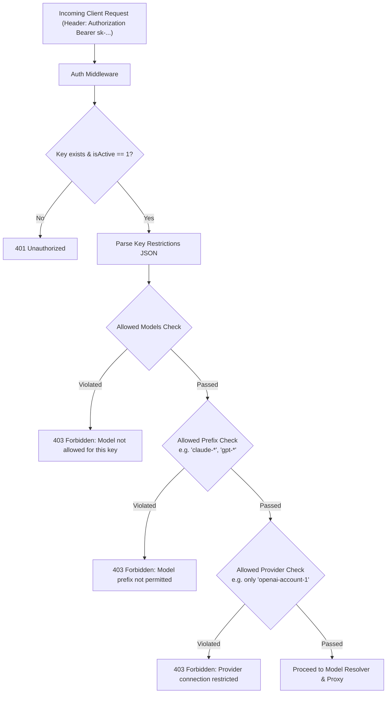

# Product Requirements Document (PRD) — Zyrouter

> **Scope update (2026-09-02):** The current product is proxy-first. The historical parity sections below describe the original reference scope; active runtime scope is governed by `zyrouter/plan.md`.

## Current Product Scope

Zyrouter currently ships as a Go proxy engine, Admin Dashboard, and edge proxy deployment control plane. Media endpoints, MITM, Headroom, and CLI tools are retired from the active runtime. Cloudflare, Deno, and Vercel proxy-pool deployment remain supported.

The backend also exposes a server-controlled Client API contract for future client key management. The Client Dashboard UI is intentionally out of scope for the current implementation phase.

---

## 1. Executive Summary & Visi Produk

**Zyrouter** (Zyvenox Router) adalah AI Gateway & Proxy Router berperforma tinggi yang menggabungkan kecepatan eksekusi dan efisiensi memori dari **Golang Engine** dengan **Dashboard Manajemen Modern (100% Redesigned)**.

Zyrouter dirancang untuk menjadi gateway terpadu yang menjembatani berbagai LLM provider (OpenAI, Anthropic Claude, Google Gemini, Ollama, DeepSeek, Grok, OpenRouter, Mistral, dll.) ke aplikasi klien dan developer tools (seperti Claude Code, Codex CLI, Cursor, Qoder, dll.).

### Nilai Tambah Utama:
1. **Ultra-Fast Go Engine:** Response latency minimal, zero-alloc token streaming, concurrency tinggi, dan footprint memori rendah.
2. **100% Redesigned Dashboard:** Antarmuka visual baru bergaya modern dark-mode glassmorphism dengan tipografi dan visualisasi data yang memukau.
3. **Zero Mockup Data:** Semua metrik, grafik, daftar provider, log, dan status kesehatan bersumber 100% dari backend Go dan database SQLite riil (`zyrouter.db`).
4. **Granular API Key Governance (Fitur Baru):** Kontrol ketat otorisasi API key dengan pembatasan model spesifik, wildcard prefix (`claude-*`, `gpt-*`), provider binding, serta batas kuota.
5. **100% Feature Parity:** Menjaga semua kemampuan `9router-custom` dan `9router-go-patched` tanpa ada fitur yang dihilangkan.

---

## 2. Analisis Referensi & Gap Analysis

| Aspek | 9router-custom (Reference) | 9router-go-patched (Reference) | **Zyrouter (Target Produk)** |
| :--- | :--- | :--- | :--- |
| **Engine Core** | Node.js / Next.js Server | Golang (`chi` router, SQLite WAL) | **Golang Engine Berperforma Tinggi** |
| **Dashboard UI** | Next.js standard UI | Tidak ada dashboard | **100% Redesigned Modern UI (Standalone / Embedded)** |
| **Dashboard Data** | Direct SQLite / Local API | N/A | **100% Real REST API + SSE Stream dari Go Backend** |
| **API Key Auth** | Validasi dasar (Active/Inactive) | Validasi dasar (Active/Inactive) | **Granular Restrictions: Model whitelist, Prefix wildcards, Provider locks** |
| **Format Conversion** | JS-based streaming/translators | Go-based fast translators | **Go-based stream translators (OpenAI ↔ Claude ↔ Gemini)** |
| **Token Savers** | RTK, Caveman, Ponytail | RTK, Caveman, Ponytail, Injection Guard | **RTK, Caveman, Ponytail, Injection Guard** |
| **Combos & Fusion** | Fallback, RR, Sticky, Fusion | Fallback, RR, Sticky, Fusion | **Full Parity dengan Go Engine** |
| **Proxy Pools & MITM** | Cloudflare / Deno / Vercel, MITM | Cloudflare / Deno / Vercel, MITM | **Full Parity di Go Engine** |

---

## 3. Fitur Utama & Spesifikasi Fungsional

### 3.1. Core AI Proxy & Format Translators
- **Standard Endpoints:**
  - `POST /chat/completions` / `POST /v1/chat/completions` (OpenAI format)
  - `POST /messages` / `POST /v1/messages` (Anthropic Claude format)
  - `POST /messages/count_tokens` (Anthropic Token Counter)
  - `POST /api/chat` (Ollama format)
  - `POST /embeddings`, `POST /responses`, `POST /responses/compact`
- **Native Translation Engine:**
  - Translasi dua arah OpenAI Format ↔ Anthropic Claude Format ↔ Gemini Native Format tanpa kehilangan konteks, tool calls, atau function schema.
- **Resilient Streaming with StallReader:**
  - Streaming SSE (`text/event-stream`) dengan timeout detection (6 menit stall threshold), auto-reconnect, dan clean client disconnect handling.

---

### 3.2. Combo Strategies & Dynamic Routing
Mendukung pengelompokan model (combo) dengan strategi fleksibel:
1. **Fallback:** Mencoba model berurutan sesuai urutan prioritas; beralih otomatis jika terjadi error / rate-limit.
2. **Round-Robin:** Merotasi request ke daftar model secara berurutan untuk mendistribusikan beban.
3. **Sticky:** Mempertahankan koneksi/model yang sama hingga batas `consecutiveUseCount` tercapai sebelum rotasi.
4. **Fusion (Multi-Panel Quorum + Judge Synthesis):**
   - Mengirim prompt ke beberapa model panel secara paralel.
   - Mengumpulkan jawaban dengan toleransi straggler (`stragglerGraceMs`) dan minimum quorum (`minPanel`).
   - Menggunakan model Judge untuk mensintesis jawaban terbaik dari panel anonim.
5. **Auto-Capability Switching:**
   - Deteksi otomatis kebutuhan `vision` (gambar) atau `pdf` dalam payload dan mereorder model secara dinamis ke provider yang mendukung kemampuan tersebut.

---

### 3.3. Token Savers & Prompt Optimization
- **RTK (Real-Time Compression):** Mengompresi input context redundan untuk menghemat token.
- **Caveman Style:** Menginstruksikan model menghasilkan output yang sangat padat dan ringkas sesuai level konfigurasi (`lite`, `medium`, `extreme`).
- **Ponytail Style:** Menghasilkan output kode yang efisien tanpa boilerplates berlebih.
- **Prompt Injection Guard:** Mendeteksi dan mencegah upaya injeksi prompt berbahaya sebelum request diteruskan ke upstream.

---

### 3.4. Granular API Key Governance (NEW FEATURE)

Sistem otorisasi API key diperluas untuk memberikan kontrol penuh bagi administrator:



#### Struktur Kolom `restrictions` (JSON):
```json
{
  "allowedModels": ["gpt-4o", "claude-3-5-sonnet-20241022", "deepseek-chat"],
  "allowedPrefixes": ["claude-*", "gpt-4*"],
  "allowedProviders": ["conn-openai-prod", "conn-anthropic-main"],
  "blockedModels": ["gpt-4-32k"],
  "rateLimit": {
    "requestsPerMinute": 60,
    "tokensPerDay": 5000000
  },
  "expiresAt": "2026-12-31T23:59:59Z"
}
```

---

### 3.5. Provider Management & Resiliency
- **Multi-Account Support:** Dukungan banyak akun untuk setiap provider dengan prioritas, bobot, dan rotasi.
- **Exponential Backoff & Cooldown:** Klasifikasi otomatis error (429 Rate Limit, Quota Exceeded, Overloaded) dengan exponential backoff bertingkat (Level 1–15).
- **Per-Connection Model Locking:** Mengunci kombinasi provider/model tertentu yang mengalami kendala sementara tanpa memblokir koneksi provider lainnya.
- **Reset State Endpoint:** Kemampuan mereset status cooldown/health per model langsung dari dashboard.

---

### 3.6. Proxy Pools & CLI Interceptor (MITM)
- **Proxy Pools:** Integrasi serverless edge proxy (Cloudflare Workers, Deno Deploy, Vercel Edge) untuk membypass IP throttling.
- **MITM Interception:** DNS redirection dan TLS proxy interceptor pada port 443 untuk mengarahkan traffic developer tools (`claude-code`, `codex`, `qoder`) langsung ke Zyrouter tanpa modifikasi file config CLI.

---

### 3.7. Media & Extended APIs
- Image Generation (`/images/generations`)
- Speech / TTS (`/audio/speech`, `/audio/voices`)
- Audio Transcription (`/audio/transcriptions`)
- Video AI Generation & Edits (`/videos/generations`, `/videos/edits`, `/videos/extensions`, `/videos/{id}`)
- Web Search & Scrape (`/search`, `/scrape`, `/web/fetch`)
- Headroom token compression proxy (`/headroom/*`)

---

## 4. UI/UX Dashboard Redesign (100% Fresh Design)

### 4.1. Design Aesthetics & Guidelines
- **Theme:** Dark Cyber-Minimalist Glassmorphism (Deep Obsidian `#0A0D14`, Midnight Slate `#101726`, Neon Cyan `#00E5FF`, Electric Violet `#7C4DFF`, Emerald Accent `#00E676`).
- **Typography:** Outfit / Inter (Google Fonts) dengan tabular numbers untuk metrik token.
- **Dynamic Topology Visualizer:** Graf interaktif yang menampilkan aliran traffic request dari client → API Key → Router → Provider → Upstream secara real-time melalui SSE.
- **Zero Mockup Rule:** Jika database kosong, tampilkan state "Zero Data" yang bersih dengan wizard setup cepat, bukan dummy hardcode.

### 4.2. Halaman Dashboard
1. **Overview / Real-Time Pulse:** Metrik RPS, Total Tokens, Cost Estimation, Active Providers Status, Traffic Topology Graph.
2. **Provider Connections:** List koneksi dengan status badges (Active / Cooling Down / Locked), latency pill, priority slider, dan modal tambah/edit kredensial.
3. **Model Combos & Fusion:** Canvas builder untuk mengatur urutan fallback, rotasi round-robin, atau tuning parameter multi-panel fusion (straggler grace, min quorum, judge selector).
4. **API Keys & Policy Manager:** Generator API Key dengan modal konfigurasi restriksi visual (checkbox list model, input tag prefix, selector provider, dan batas kuota).
5. **Usage Analytics & Cost Ledger:** Grafik token harian, pembagian biaya per model/provider, filter rentang tanggal, dan export log.
6. **Live Console & Stream Inspector:** Monitor log request/response secara real-time dengan filter status code, keyword search, dan payload viewer.
7. **Token Savers & Security:** Switch kontrol RTK, selector level Caveman & Ponytail, toggle Prompt Injection Guard.
8. **Proxy Pools & Deployer:** Visual status proxy worker Cloudflare/Deno/Vercel dengan action deploy satu klik.
9. **MITM & CLI Tools:** Switch aktivasi MITM, instruksi konfigurasi tools CLI, status sertifikat TLS.
10. **Interactive Chat Playground:** Built-in playground untuk menguji performa model, respons translasi, dan latensi secara langsung.
11. **Settings & Maintenance:** Backup database SQLite (`zyrouter.db`), import data, setting port, dan update engine.

---

## 5. Non-Functional Requirements

1. **Performance:** Latensi internal router < 5ms (di luar waktu tunggu upstream LLM).
2. **Memory Footprint:** Engine Go idle memory < 30MB.
3. **Database Integrity:** SQLite dalam mode WAL (Write-Ahead Logging) dengan concurrency-safe connection pool.
4. **Clean Code & Workspace:** Terorganisir rapi di bawah folder `zyrouter/` tanpa mencemari folder workspace lain.
5. **Observability:** Logging terstruktur dengan Request ID tracking, trace latensi p50/p95.
